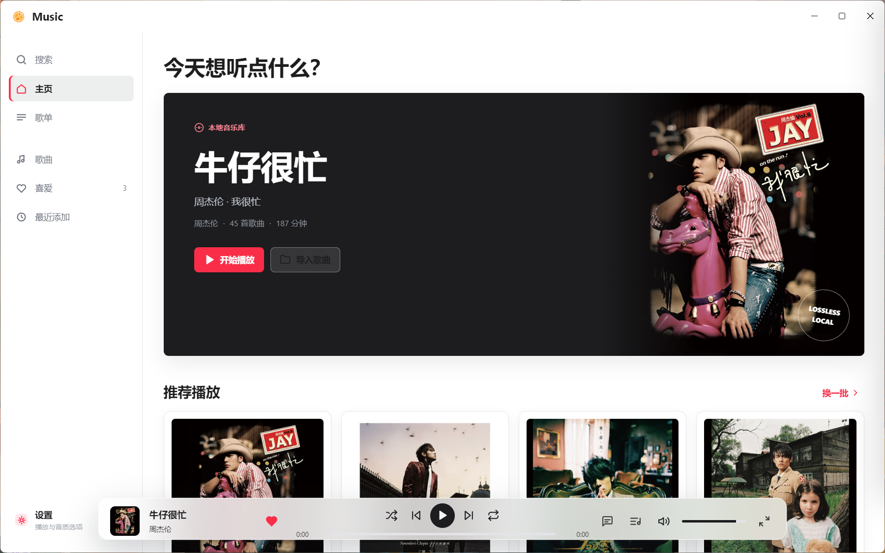
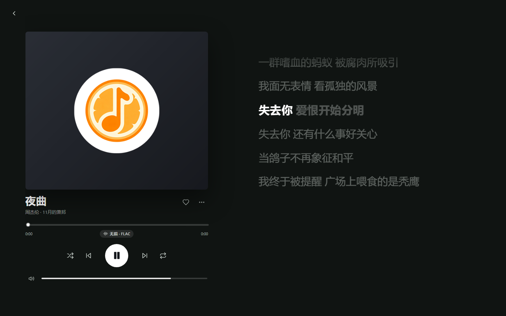
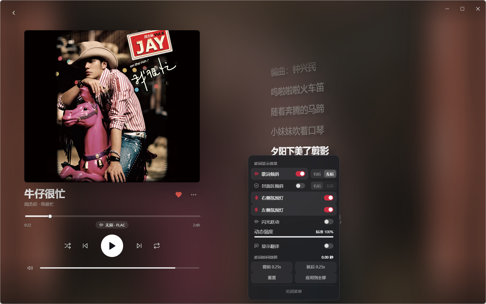
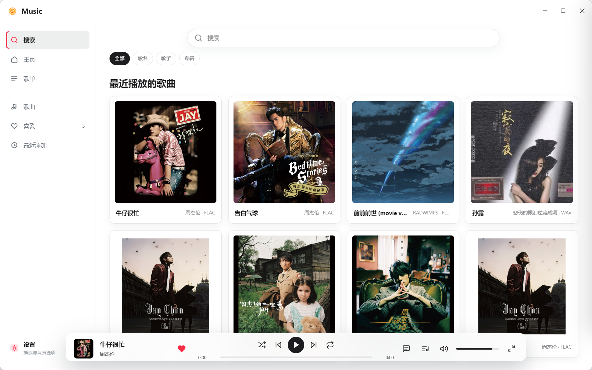

# Orange Music · 本地音乐播放器

一个纯本地运行的 Windows 桌面音乐播放器：支持 MP3 / FLAC / AAC / WAV / OGG 等常见格式，自动读取标签与封面；歌词逐字同步，内置十段均衡器与音量均衡，支持多歌单与资料库自动扫描，还带托盘控制、全局快捷键和可自定义的界面配色。  
用 Electron + 原生 HTML / CSS / JavaScript 写成，没有前端框架依赖。



## 功能

**音乐库**

- 扫描文件夹或选择文件导入，自动识别常见音频格式
- 自动读取标签：标题 / 歌手 / 专辑 / 封面 / 内嵌歌词
- 关闭软件后资料库会保留，下次启动自动恢复（原文件不在原位置时会自动跳过）
- 支持手动刷新：同一文件夹只导入新歌，重复文件按路径去重
- 「只导入歌曲」：自动跳过音效、提示音、语音等非歌曲音频（可按最短时长调整）
- 歌曲详情：格式 / 时长 / 文件大小 / 平均码率 / 采样率 / 声道 / 位深 / 文件位置，可一键定位到文件夹
- 编辑歌曲信息（标题 / 歌手 / 专辑 / 封面，只改资料库不改原文件）
- 查找重复歌曲，一键清理
- 多选 + 全选：批量添加到歌单、批量移除

**播放**

- 播放 / 暂停、上一首 / 下一首、随机、列表循环 / 单曲循环
- 记忆播放进度，再次打开继续上次位置
- 淡入淡出（时长可调）、播放速度 0.5×–2×（保持音高）
- 睡眠定时器：15 / 30 / 45 / 60 / 90 分钟或「播完本曲」
- 音量均衡（ReplayGain）与十段均衡器（31Hz–16kHz，含流行 / 摇滚 / 古典 / 人声 / 低音 / 高音 / 爵士 / 电子预设）

**歌词**

- 支持歌曲内嵌歌词（MP3 的 USLT / SYLT / TXXX，FLAC、OGG 的 LYRICS 注释，M4A 的 ©lyr）与同名 `.lrc`
- 歌词文件支持 UTF-8 / UTF-16 / GBK 编码，文件名可带 `01.` 之类的序号前缀
- 逐字点亮效果，带轻微漂浮动画
- 右键歌词可按 **0.25 秒** 微调，**按歌曲独立记忆**
- 播放中可以自由上下翻歌词，不会被打断，右下角可一键「回到当前」





**外观与系统**

- 浅色主题色：默认白 / 蜜桃 / 薄荷 / 天青 / 藕荷 / 柠檬 / 樱花
- 播放浮窗（底部播放条）与左侧功能栏可各自选择 模糊 / 亚克力 / 半透明 / 高斯模糊，并调节模糊与透明程度
- 歌词界面配色可跟随封面、深色或浅色
- 最小化到托盘、关闭时最小化到托盘、开机自启，托盘菜单可控制播放
- 支持键盘媒体键；快捷键可在设置里点一下重新绑定



## 下载与使用

免安装便携版：

1. 在 [Releases](../../releases) 下载 `Orange-Music-Setup-x.x.x.exe`（或者解压便携包）
2. 双击 `Orange Music.exe` 启动
3. 进入「歌曲」页 → 「扫描文件夹」选择你的音乐目录

> 首次使用建议在「设置 → 自动扫描」里添加常用音乐文件夹并开启「启动时自动扫描」，  
> 以后打开软件会自动把新歌加进来。

## 从源码运行 / 构建

环境要求：Node.js 18+（推荐 20+）、Windows 10/11

```bash
# 安装依赖（国内可加 --registry=https://registry.npmmirror.com）
npm install

# 直接运行
npm start

# 打包成安装程序（输出到 release/）
npm run dist
```

## 快捷键

在「设置 → 快捷键」里点任意一行即可重新绑定。

| 功能          | 默认按键                    |
| ----------- | ----------------------- |
| 播放 / 暂停     | `空格`                    |
| 快退 / 快进 5 秒 | `←` / `→`               |
| 音量减小 / 增大   | `↓` / `↑`               |
| 上一首 / 下一首   | `Ctrl + ←` / `Ctrl + →` |
| 静音          | `M`                     |
| 喜爱当前歌曲      | `F`                     |
| 打开 / 关闭歌词界面 | `L`                     |
| 播放队列        | `Q`                     |
| 随机播放        | `S`                     |
| 切换循环模式      | `R`                     |
| 搜索          | `Ctrl + K`              |
| 关闭弹层 / 返回   | `Esc`                   |

其他操作：双击顶部标题栏可最大化 / 还原，拖动标题栏可移动窗口；歌词界面点右键可微调歌词时间。

## 支持的音频格式

| 情况                         | 格式                                             |
| -------------------------- | ---------------------------------------------- |
| 直接播放                       | MP3、FLAC、AAC / M4A、WAV、OGG、Opus、AIFF           |
| 自动转码播放（内置 FFmpeg，本机完成、不联网） | ALAC、WMA、APE 等系统不支持的编码                         |
| 无法播放                       | 网易云 `.ncm`、QQ 音乐 `.qmc/.mflac`、酷狗 `.kgm` 等加密文件 |

## 目录结构

```
.
├── main.js                # 主进程：窗口、IPC、托盘、文件扫描、ffmpeg 转码
├── preload.js             # 渲染进程与主进程之间的安全桥接
├── renderer/
│   ├── index.html         # 界面结构
│   ├── styles.css         # 全部样式与主题
│   ├── app.js             # 界面逻辑：播放、资料库、歌词、设置
│   ├── tags.js            # 音频标签 / 歌词解析（主进程与渲染进程共用）
│   └── assets/            # 图标与默认封面
├── assets/                # 应用图标（打包用）
├── docs/
│   ├── 使用说明.txt
│   └── screenshots/
└── package.json
```

## 常见问题

**导入后列表是空的？**  
先确认文件是普通音频（MP3 / FLAC / WAV / M4A 等），加密音乐文件无法播放；  
另外「只导入歌曲」会跳过时长过短、没有标签的音效文件，可在设置里关闭。

**歌词显示不出来？**  
点歌曲行的 ⓘ 打开歌曲信息，可以「导入歌词」或「粘贴歌词」；  
也可以把同名的 `.lrc` 放在歌曲旁边，播放时会自动读取。

**歌词对不上时间？**  
在歌词界面点右键，用「歌词提前 / 延后 0.25 秒」微调，只对这首歌生效并自动记住。

**重启后歌曲不见了？**  
资料库记录的是文件路径，如果音乐被移动或删除了就会跳过；重新扫描一次即可。

## 第三方许可

- [Electron](https://github.com/electron/electron)（MIT）
- [FFmpeg](https://ffmpeg.org/)（通过 `@ffmpeg-installer/ffmpeg` 分发，遵循其自身许可证，LGPL / GPL）

本项目的自有代码以 MIT 许可证发布，详见 [LICENSE](LICENSE)。
